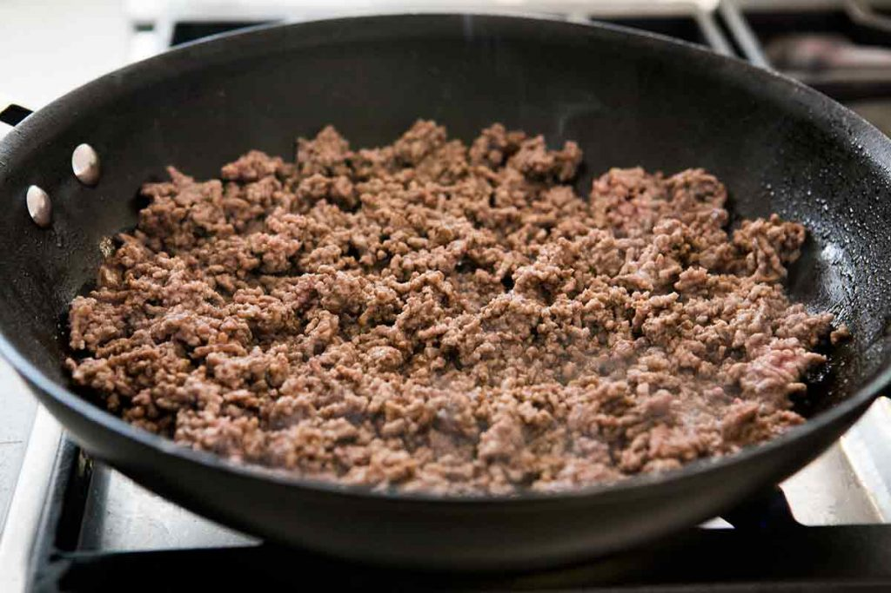

WEB14103-Ricardo-Welch

# Lasagna Recipe

##### Prep time: 15 mins     Cooking time: 1hr 30mins     Serves: 8

### Ingredients 

#### Sauce:
- olive oil
- 1 pound lean ground beef
- Olive oil
- 1/2 onion, diced, about 3/4 cup
- 1/2 large bell pepper (green, red, or yellow), stem and core removed, diced, about 3/4 cup
- 2 cloves garlic, minced
- 1 28-ounce can good quality tomato sauce
- 3 ounces (half a 6-oz can) tomato paste
- 1 14-ounce can crushed tomatoes
- 2 Tbsp chopped fresh oregano or 2 teaspoons dried oregano
- 1/4 cup chopped fresh parsley (preferably flat leaf), packed
- 1 Tbsp Italian Seasoning
- Pinch of garlic powder and/or garlic salt
- 1 Tbsp red or white wine vinegar
- 1 Tbsp to 1/4 cup sugar (to taste, optional)
- Salt

#### Lasagna:

- 1/2 lb dry lasagna noodles (requires 9 lasagna noodles - unbroken)
- 15 ounces Ricotta cheese
- 1 1/2 lb (24 ounces) Mozzarella cheese, grated or sliced
- 1/4 lb (4 ounces) freshly grated Parmesan cheese

#### Cooking Utensils:
- A large skillet to brown the beef, bell pepper, and onion
- A large pot (8 to 12-quarts) for cooking the pasta
- A medium sized pot (3 to 4 quarts) to simmer the sauce
- 13" x 9" x 2" lasagna pan, preferably pyrex or stainless steel (avoid aluminum pans if you can, they can react with the acidity of the sauce)
- A large colander to drain the noodles
- A couple large sheet pans to cool the noodles
- A large slotted cooking spoon
- A large wooden cooking spoon
- A chef's knife or large paring knife to cut the vegetables

## Method

#### step 1 
Put a large pot of salted water (1 Tbsp salt for every 2 quarts of water) on the stovetop on high heat. It can take a while for a large pot of water to come to a boil (this will be your pasta water), so prepare the sauce in the next steps while the water is heating.
 

#### step 2 
In a large skillet heat 2 teaspoons of olive oil on medium high heat. Add the ground beef and cook it until it is lightly browned on all sides.
 
 Remove the beef with a slotted spoon to a bowl. If there is more than a tablespoon of fat left in the pan (there shouldn't be if you are using lean ground beef) remove it from the pan.
 
#### step 3 
Add the diced bell pepper and onions to skillet (in the photo we are using yellow bell pepper and red onions).
Cook for 4 to 5 minutes, until the onions are translucent and the peppers softened. Add the minced garlic and cook half a minute more.
Return the browned ground beef to the pan. Stir to combine, reduce the heat to low and cook for another 5 minutes.

#### step 4 
Transfer the beef pepper onion mixture to a medium sized (3 to 4 quart) pot. Add the crushed tomatoes, tomato sauce, and tomato paste to the pot.
Add the parsley, oregano, and Italian seasonings, adjusting the amounts to taste. Sprinkle with garlic powder and/or garlic salt, to taste.
Sprinkle with red or white wine vinegar. Stir in sugar, a tablespoon at a time, tasting after each addition, to taste. (The amount of sugar needed will vary, depending on how acidic the tomatoes are that you are using.)
Add salt to taste, and note that you will later be adding Parmesan, which is salty.
 1024x683.jpg)

#### step 5 
By now the salted water you started heating in step one should be boiling. Add the dry lasagna noodles and cook then per package directions (al dente). (Note noodles may be cooked in advance.)
Stir often to prevent from sticking. Make sure that water remains at a full rolling boil during the entire cooking to prevent noodles from sticking.
When ready, drain in a colander and rinse with cool water, gently separating any noodles that may be sticking together.

Spread a little olive oil on a large rimmed baking sheet, and lay out the cooked noodles on this sheet, turning them over so that they get coated with a little of the olive oil. This will prevent them from sticking together.

#### step 6 
 In a 13x9x2-inch casserole or lasagna dish, ladle a cup of sauce and spread it over the bottom of the dish. Arrange one layer of lasagna noodles lengthwise (about 3 long noodles, edge may overlap, depending on your pan) over the sauce. Ladle a third of the remaining sauce over the noodles.
 
 (vvvvv)
 Sprinkle a layer of a third of the grated mozzarella on top of lasagna sauce. Add half of the ricotta cheese, by placing cheese dollops every couple inches. Sprinkle the grated parmesan cheese evenly over the top of ricotta cheese.
 (vvvvv)
 Apply second layer of noodles, top it with half of the remaining sauce. Add half of the remaining Mozzarella, the remaining ricotta cheese, and another thin sprinkling of Parmesan.
Finish with another layer of noodles. Spread the remaining sauce over the top layer of noodles and sprinkle with the remaining Mozzarella cheese

#### step 7
Tent the lasagna pan with aluminum foil (not touching noodles or sauce). Bake at 375°F for 45 minutes. Allow to cool before serving.
May be reheated in conventional oven or microwave. Leave aluminum tent on for storage. (Try to keep the aluminum foil from touching the sauce.)

